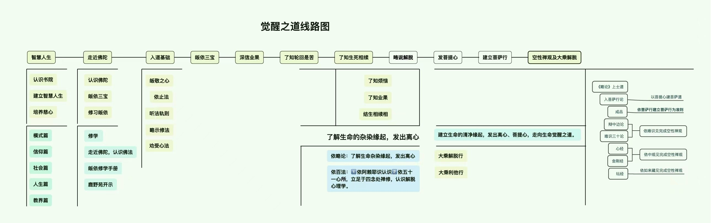
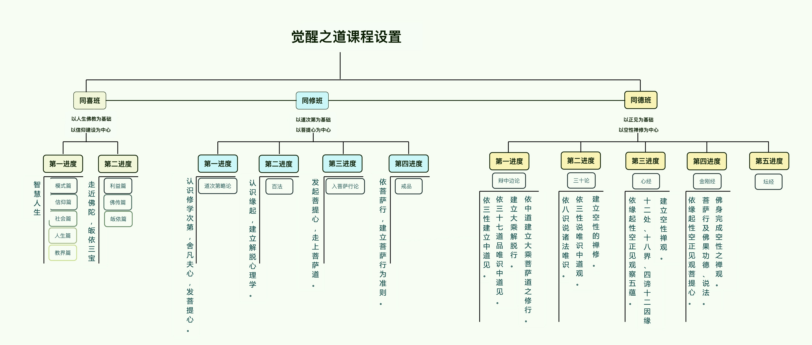
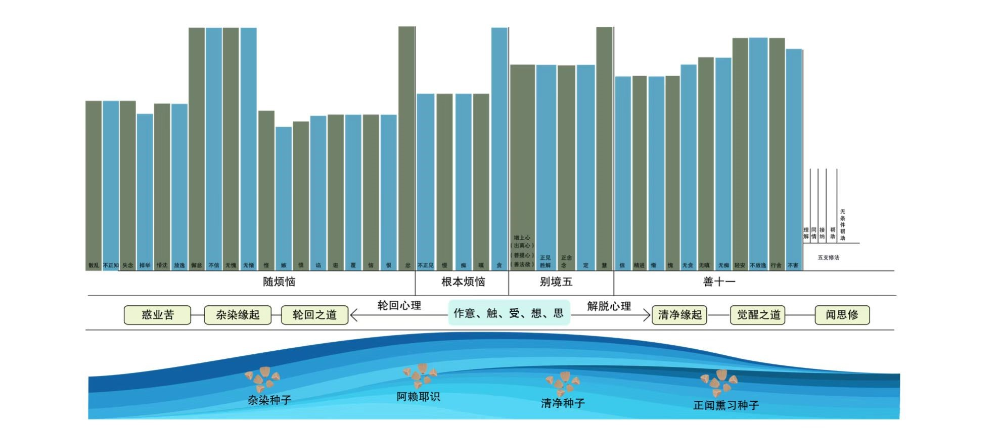

# 认识菩提导航

——讲于 2023 年农历二月十九

> 济群法师

在观音菩萨圣诞讲述“认识菩提导航”，意义重大。可以说，菩提导航也像观音菩萨的千手千眼那样，能以极大的方便服务众生，帮助社会，是慈悲精神的体现。

我从 2016 年开始做菩提导航，前后历时六年。随喜我们优秀的科研团队，因为他们的精进努力，才有这样一个助力修学的高科技工具。应该说，我也是其中的重要参与者。据统计，在导航建设过程中，我的相关讲话多达 76 万字。

为什么要做菩提导航？大家应该用过各种路线导航。过去我们去陌生地方，尤其是大城市，寻找自己要去的处所是件难事。怎么走？怎么坐车？即使反复查问，还是会出错。有了导航之后，只要一设置，到哪都很方便。而且这种指引是实时的，稍微有点偏离，就能立刻得到提醒，纠正错误，回到正道。

学佛同样存在这个问题。事实上，比起现实中的任何道路，修行路要难百倍、千倍、万倍甚至更多。在各个阶段，都有不同的歧路和障碍。很多人有心学佛，但面对博大精深的佛法，根本不知该怎么走，或是盲修瞎练，或是偏执一端。即使修学某个法门，诵诵经，打打坐，也往往不清楚自己已走到哪里。如果不得力，问题又出在哪里？

我们做菩提导航的初心，就是要让佛法不再难学。任何人只要想学，就能依此深入，并且随时对照，纠正偏差。以下，我从七个方面为大家介绍。

## 一、三级修学课程的建设

针对以上问题，我在 2004 年发表了《汉传佛教的反思》。佛教传入中国后，自隋唐达至鼎盛。为什么明清之后一路衰落？今天的人应该如何认识并学习传统宗派？通过反思，我提出皈依、发心、戒律、正见、止观五大要素。任何一个完整的修学体系，都应该包含这些要素，否则是不完整的。

随后，我又在世界佛教论坛发表《一个根本，三大要领》。一个根本，即“建立大众化的修学体系”。之所以强调大众化，是希望大家都能修学，而不是局限于少数人。三大要领，即完善三项制度，一是僧伽教育制度，二是僧团管理制度，三是弘法布教制度。做好这三项制度的建设，才能确保佛教的健康发展。

基于这些思考，从 2008 年起，我们就开始探索三级修学体系，希望建立一条有次第的修学之路。首先是有效的引导，即目标明确、路线清晰、具有可操作性；其次是良好的氛围，让大家在修学中彼此增上。应该说，三级修学体系的建设，为菩提导航提供了重要基础。缺乏这个基础，导航是做不起来的。

## 二、三张图与“12459”

2016 年的三张图，和 2019 年关于“12459”的开示，是建设导航的关键。

我们的科研团队包括 It 界、高校、心理学界等领域的优秀人才，开始做导航时，大家有许多思路。首先，想到佛陀成道前，经历了降魔的过程。在我们的修行路上，每个站点都要战胜魔障，才能继续前行。是否可以模仿西游记的思路，历经九九八十一难？

其次，想到生命程序的产生原理。我们的前六识，尤其是意识，时时都在起心动念。这个过程就在编写生命程序，并储藏于阿赖耶识，形成种子。不同的种子，便会形成不同的生命代码，呈现不同的生命现象。

最后一个思路，是关于生命的海洋。唯识宗把我们的意识喻为大海：“藏识海常住，境界风所动，种种诸识浪，腾跃而转生。”在这个海洋中，因为境风吹动，会现起种种波浪。其中包含两种缘起，一是杂染缘起，由有漏种子，形成动荡、污浊、昏暗的轮回海洋；一是清净缘起，通过正闻熏习，完成生命转依，显现平静、清澈、明亮的海面。修行，正是治理生命海洋的过程。

为了做导航，大家提出各种设想，但落实起来有一定难度。因为我们要做的是生命产品，其底层逻辑，又取决于生命的底层逻辑。究竟怎么呈现？

### 1.三张图

2016 年，我画了三张图。

图一，提出菩提导航的路线。

\

\

这张图标明了菩提导航的路线框架，提出整个修行的流程，包括十大站点和若干小站，应该说是导航的雏形。后来虽然名称略有改变，但结构基本如此。

图二，确定各阶段的课程和重点。

\

\

这张图是菩提导航的修学之路，为具体的课程设置提供了指导意见。

图三，生命海洋，依染净缘起，说明轮回与解脱的心理过程。

\

\

这张图呈现了生命海洋的两大内涵，包括杂染缘起和清净缘起。其中以《百法》的五遍行，即作意、触、受、想、思为基础，依无明、烦恼、贪嗔痴，进入惑业苦的轮回路线，开展杂染缘起；通过正闻熏习，依正见、正念导向觉醒和解脱，建立清净缘起。在曲线图中，通过修学反映轮回和觉醒过程中的心理情况，是导航建设人格模型和生命海洋的重要依据。

### 2. 12459 的修行密码

2019 年春，我讲了《一条道路，九种禅修》，提出“12459”的成佛修行密码。一是一条道路，二是两个层面，四是四种身份，五是五处用心，九是九种禅修。其中，一条道路是路线，四种身份是流程，五处用心是任务，九种禅修是方法。此后，只是对九种禅修稍作优化，改为六种禅修：即慈心的禅修、八步三禅、皈依的禅修、正念的禅修、菩提心的禅修和空性禅修。

走在菩提路上，会经过哪些阶段？要完成什么样的修行任务？又该用什么方法来完成？文中，既指出了走向觉醒的途径，也阐明了菩提导航的底层逻辑。

## 三、一条道路的设立

一条道路，包含修学之路和心灵之路两个层面。

### 1.修学之路

修学之路共有十大站点，即智慧人生、走进佛陀、入道基础、皈依三宝、深信业果、发出离心、修解脱行、发菩提心、修菩萨行、空性禅修。每个站点又开出若干，共四十二个小站。这些站点的设立有什么依据呢？

第一，这条道路要符合修行逻辑。三乘佛法中，人天乘有人天乘的逻辑，解脱道有解脱道的逻辑，菩萨道有菩萨道的逻辑，彼此之间还有关联。我们要设立的不单纯是解脱道，也不单纯是菩萨道，而是成佛之道，必须和整个修学逻辑不相违。

第二，这条道路要兼具完整性和独立性。很多人学佛，往往停留在某个点上，或是诵经，或是打坐，还有人特别喜欢持戒。这样就会产生偏差。作为完整的修学体系，必须具备皈依、发心、戒律、正见、止观五大要素，才能涵盖信仰建设和戒定慧三学。同时，各阶段的修学还要有一定独立性，才能有次第地分段前行。三级修学的施设有初级、中级、高级，就像社会上读书，有小学、中学、大学，层层递进。

第三，这条道路要大众化，而不仅是适合少数人。在佛教发展过程中，出现了精英化和民俗化两个极端。传统的天台、华严、唯识、中观，基本属于精英佛教，有能力研究、修持的人极少。而那些烧香、拜佛、求保佑的普通信众，对佛法的了解又少得可怜，甚至流于迷信。所以，我们希望打通精英和民俗的隔阂，让大家都能修学正法，从中受益。

第四，这条道路要简明直接，具有可操作性。佛法有三大语系、无数宗派，大家都希望自己“深入经藏，智慧如海”，事实上，却往往被如海的知见所淹没，抓不住要领。我在修学过程中发现，这些宗派都有共同的核心，就是从迷惑走向觉醒，进而帮助众生从迷惑走向觉醒。我们建构的修学体系也要立足于此，直达核心。更重要的是具有可操作性，如果学了很多义理，只是拿来谈玄说妙，遇到问题却用不起来，就是研究佛学而非学佛了。所以这点特别重要，必须落实到心行，才能依法改变自己的观念、心态乃至生命品质。

第五，这条道路不能有危险和副作用。因为种种原因，有些人学佛学得怪怪的，甚至学出各种问题，不仅影响个人的法身慧命，还使大众对学佛产生误解。这是需要特别注意的。虽然问题多是由个人修学偏差造成的，但我们在设置课程时，可以未雨绸缪，有针对性地加以预防。

这是关于修学之路的建设要求。

### 2.心灵之路

除了修学之路，我们还要建立心灵之路。就像射箭，你给人箭之后，还要给他立个靶，否则他就不知道该射向哪里。我们修学种种法门，研读种种经论，究竟要导向哪里？达到什么目的？很多人并不清楚。设立心灵之路，正是帮助我们明确修学所要成就目标所在。心灵觉醒之路包括四个部分内容。

第一，共同基础心理，包含信心、惭愧、忏悔、出离心、菩提心、持戒、精进等。这是三乘修行都要具备的共同基础。当然也有个别差异，比如走解脱道只要出离心即可，走菩萨道还要进一步发菩提心。

第二，解脱相应心理。解脱不是一个点，而是迈向觉醒的心理之路。《百法》的作意、正见、胜解、念、定、慧、无贪、无嗔、无痴、轻安、行舍，禅宗的无所得心、无念、平常心，都是与此相关的心理。如何落实这些心理，真正走向觉醒？在三级修学课程中，正念是修行的关键，正念是开启觉醒的钥匙，作意、正见等是迈向觉醒的辅助心理。

第三，慈悲相应心理。汉传佛教属于大乘，但真正发起菩提心、具足慈悲心的人并不多。如何把菩提心和慈悲心修起来，而不是流于口号？我找到的抓手，是依《慈经》修习慈心。这个修法操作性很强，大家都能做得起来。在慈心的基础上，再发菩提心，修慈悲心，就不会流于空洞。

进一步，还要落实到菩萨行。关于菩萨行的项目，我们最熟悉的就是六度四摄，即布施、持戒、忍辱、精进、禅定、般若、爱语、利行、同事，但做得是否到位？如果不到位，原因是什么？我在思考过程中发现，六度四摄还有更基本的修习要素，即随喜、感恩、理解、同情、接纳、陪伴、关爱、引导等。这些是修习慈悲必须具备的心理要素，在此基础上，才能有效修习六度四摄的菩萨行。如随喜和感恩，可以帮助我们建立慈悲心。理解、同情、接纳，又是修习布施、爱语等利他行的前提。如果没有这些心理，布施、爱语往往会修得很主观，难以真正利他。而在圆满菩提心的过程中，还要修习大悲心、无我利他心、平等心、无所得心、无住，才能使世俗菩提心升华为胜义菩提心，成就无上菩提。

第四，轮回相应心理，主要有《百法》所说的根本烦恼和随烦恼。根本烦恼，是贪、嗔、痴、慢、疑、恶见。随烦恼又分为小随烦恼十种，即忿、恨、恼、嫉、悭、诳、谄、骄、覆、害。中随烦恼两种，即无惭、无愧。大随烦恼八种，即不信、懈怠、昏沉、掉举、放逸、失念、不正知、散乱。这些都是必须解决的不良心理。在觉醒路上，我们要逐一认出这些心理，通过修习止观，把此彻底解除。

立足于以上四个部分，我们就知道修行究竟要建立什么，摆脱什么，才能使所学落到实处。此外，我们还要了解修学之路和心灵之路的关系，知道在哪个站点，应该修习哪些心理。关于这个问题，在设计导航的过程中，我曾编写“依三级修学走向觉醒的路线图”，列出每个站点的课程、流程、修学说明、修学方法，以及这个站点需要建立及解决的心理。

## 四、四种身份，分阶教育

佛教有句话，叫作“佛道长远，久经辛苦，方有成就”。但汉传佛教可能受禅宗影响，好简好顿，总想着一超直入如来地。但现实的情况是，很多人根机不够，又缺乏善知识引导，怎么悟得起来？所以要辅以渐修，通过有次第的学修，逐步接近终点。

### 1.四种身份设立的依据

社会上的教育，从幼儿园到博士后都是有次第的。每个人可以根据次第，接受不同阶段的教育。在三级修学中，我们设立了学士、修士、胜士、智士四种身份。依同喜班的修学设立学士，依同修班的修学设立修士和胜士，依同德班的修学设立智士。每种身份包含相应的课程学习和人格画像，同样是一套有次第的修学体系。

第一是学士阶段，学习人生佛教系列课程，及《走近佛陀》《皈依修学手册》。这一阶段的人格画像，是通过人生佛教的学习，重建智慧的三观，解决粗重烦恼；通过正念禅修，增加心的稳定性；通过修习慈心，对自己和身边人更有爱心；通过静心慢生活，使生活更健康。

第二是修士阶段，学习《道次第》《百法》《辨修对治品》，了解佛法要领，走上解脱道。这一阶段的人格画像，是通过《道次第》的四种转心思维，生起真切的出离心、菩提心；依三十七道品，深化正念修行，建立趣向觉醒、解脱的人格。同时，也开始修习利他心。

第三是胜士阶段，学习《入菩萨行论》《瑜伽菩萨戒》，了解菩萨的人格特征，以慈心为基础，生起菩提心和大悲心，确立“我要利益一切众生”的愿望。进一步，在菩提心的基础上修习菩萨行，建立菩萨的人格特征。对菩萨行者来说，正念和解脱的能力也很重要，否则就是泥菩萨过河，自身难保。

第四是智士阶段，通过修学《辨中边论》《唯识三十论》《金刚经》，超越二元对立，建立觉醒的人格，圣贤的品质。

在此过程中，正念和利他行是贯穿四种身份的，只是在不同阶段有所侧重。

### 2.四种身份的修学要求

在修学过程中，我们要不断重温三级课程、四种身份的修学要求，明确各阶段的修学任务和方法，以及所要达到的心理目标。这是修行不可或缺的认知。在菩提导航中，对四种身份各阶段的修学，也会设置相应的提醒。比如同喜班学士阶段的修学要求中，有以下七点。

第一，认识并建立真诚、认真、老实的修学态度，依八步三禅，修学人生佛教，树立因果正见，解决粗重烦恼。

第二，学习佛陀传记，探索生命真谛，思考人生意义。通过《走近佛陀》，了解佛陀为什么要出家，如何从迷惑走向觉醒，以佛陀作为修行典范。在此过程中，要依八步三禅的修习，发自内心地以佛陀为榜样。

第三，开展初级慈心禅修，以听《慈经》为定课，以其中的修法为引导，随文入观，对他人生起友好关爱之心，发起初级利他心。

第四，学习如何用心做事，培养利他精神，落实慈心修行。

第五，把慈心带入生活，认识并建立感恩、随喜、理解、同情、接纳之心。

第六，开展初级正念禅修，修习身体扫描、静茶七式、八段锦等，选择一个所缘，培养专注和觉知，在生活中建立正念。

第七，修学《皈依修学手册》，认识皈依的内涵和意义，为进入修士阶段的修学作好准备。这是关于皈依的信仰建设，从认识到建立，也是使用八步三禅的方法。

修学要求主要告诉我们，四种身份各阶段的课程，应该如何修学，运用什么方法；正念和利他的心理，要成就什么结果。了解要求，按要求修学，是学好这一阶段课程的关键。

### 3.四种身份修学的相关心理

三级修学包含四种身份。从一条道路来说，又分修学之路和心灵之路两个层面。前面讲到，心灵之路包含共同基础心理、解脱相应心理、慈悲相应心理、轮回心理。每种心理包含七个层面，即认识、建立、培养、训练、熟悉、提升、圆满。导航中，对每种身份要修哪些心理，修到什么程度，设立了清晰、明确的标准。

在学士、修士、胜士、智士各个阶段，包含共同基础心理、正念及相关心理、利他及相关心理、轮回心理四个方面。当我们进入某个阶段，应该具备什么样的心理基础？通过这一阶段的修学，又该达到什么样的心理目标？“四种身份相关修学心理说明”中，都有清楚的说明。

此外，还有三级正念禅修和三级利他修行。初级正念禅修在学士阶段，修习静茶七式、身体扫描、经行、八段锦动中禅等，通过一个所缘，培养专注和觉知。中级正念禅修在修士阶段，通过《百法》和三十七道品的修学，重点拓展觉知力。高级正念禅修在智士阶段，通过空性理论的修学，放下觉知，体认无念。与三种正念相关的心理，在各阶段的修习和成就，也有相应说明。

三级利他也对应不同阶段。初级利他在学士和修士阶段，通过《慈经》的修学，建立慈心和相关心理。中级利他在胜士阶段，通过《入菩萨行论》的修学，发起菩提心，建立大悲心、平等心。高级利他在智士阶段，通过空性理论的修学，在利他过程中，成就无念、无住、无所得之心。正如《金刚经》所说的那样：“我今利益一切众生，实无众生得灭度者。”

三种正念和三种利他，让我们认识到，四种身份分别修习、成就什么样的正念和利他相关心理，才能由浅入深，有次第地走在菩提道上。

### 4.生命海洋

生命海洋是对修行结果的艺术性表达，关于此，菩提导航有三个内容。

首先是生命海洋的四个维度，即动和静、清和浊、明和暗、冷和暖。凡夫的生命海洋，是动荡、浑浊、昏暗、冷漠的。在修行过程中，要完成生命海洋的转化，从动荡到平静，从浑浊到清澈，从昏暗到明亮，从冷漠到温暖。这个变化可以通过修行数据来呈现，随着觉醒、解脱和慈悲、利他心理的增长，海洋就会发生改变。

其次是四艘船，分别是启明号、正念号、慈悲号和觉醒号，代表修行的四个阶段。一是启明号，在生命海洋中沉沉浮浮，随时会被打翻。偶尔也会冒出海面，显出微弱的光。通过不断修行，微光会逐渐明亮。二是正念号，就像一艘快艇，通过正念解脱的修行，可以在轮回海洋中乘风破浪，到达觉醒、解脱的彼岸。三是慈悲号，不再是一人独坐的小艇，而是万吨巨轮，可以承载一切众生抵达觉醒彼岸。四是觉醒号，就像航空飞船那样，可以超越时空，打破一切二元的局限。

每艘船都有一个口号。启明号是“开启光明觉醒的旅程”，正念号是“依正知正念走向觉醒”，慈悲号是“修习解脱相应心理，开展慈悲利他修行”，觉醒号是“通达空性，自觉觉他”。可见，四种身份始终伴随着慈悲和正念，不是某个阶段只修正念，某个阶段只修慈悲，只是在不同阶段有所侧重。

第三是四艘船的装备。我们知道，再简单的船也要有基本装备，如动力、方向盘、指南针、资粮、浮囊等。如果没有这些，船就动不了，或是存在危险。修行也是同样，所以我们设定了几种装备，即必须具备的心理。比如信心是动力，愿力是方向，正见是指南，利他是资粮，持戒是浮囊。不管是启明号、正念号、慈悲号还是觉醒号，都要具足这些装备，才能顺利航行，保障安全。

认识四种身份，就能厘清修行各阶段的流程、逻辑，需要具备的修学和心行基础，以及最终抵达的目标。

## 五、五处用心

打开菩提导航，首先出现的是五处用心，包含修学的任务和方法。这是我们顺利走上菩提路的保障。五处用心，包括自修、共修、定课、日常生活、服务大众五个方面，是三级修学特有的设置。其修行特点，主要体现于以下四点。

### 1.自修和共修

在学士、修士、胜士、智士各个阶段，我们怎么开展自修和共修？有四件事要做。

第一是了解课程。进入各个阶段时，要对当下的修学内容清清楚楚。了解修学要求后，就要使用菩提导航，按要求修学并打卡。

第二是建立态度模式。各阶段的修学，都要具备真诚、认真、老实的态度。

第三是遵循方法模式。在自修、共修时用好八步三禅。对于各个修学内容，知道自己目前在第三步、第四步，还是到第七步、第八步，以此完成观念、心态、生命品质的改变。

第四是检查用心。在自修和共修的过程中，我们应该用什么心，培养什么心，弱化什么心？比如学士阶段的自修中，有这样一些重要提醒：

自修时，了知佛陀的伟大、佛法的殊胜，是否对三宝生起信心？这是关于信心的提醒。

自修时，是否对自己的不如法言行生起忏悔心？这是关于忏悔的提醒。

自修时，认识到生命蕴含着无限价值，没能珍惜使用，是否生起惭愧心？这是关于惭愧心的提醒。

自修时，认识到生命是因缘因果的延续，是否生起止恶向善之心？这是关于向善心的提醒。

自修时，是否生起为利有情愿成佛的利他心？这是关于利他心的提醒。

自修时，是否生起真诚、认真、老实的修学态度？这是关于态度模式的提醒。

自修时，能否用八步三禅，通过观念的禅修调整心态、建立正念？这是关于正念的提醒。

自修时，是否对如此殊胜的修学因缘生起感恩心？这是关于感恩心的提醒。

自修时，是否存在懈怠、放逸？这是关于轮回心理的提醒。

在每个修学阶段，我们都设置了相关内容。自修有自修的提醒，共修有共修的提醒，定课有定课的提醒。包括在日常生活和服务大众时，都有不同的用心提醒。让我们明确，要用什么心来修学两条道路，由此建立什么心，成就什么心。

### 2.定课的要求

关于定课，同样是有要求的。

第一是修学要求。在不同修学阶段，定课会有不同的内容和要求。

第二是态度模式。我们做定课时，是不是真诚、认真、老实？只有端正态度，才会把心力投注其中，与法相应，而不是有口无心地念一念。

第三是方法模式。在四种身份各阶段的修学中，定课有《慈经》、皈依、菩提心、正念和无念。正确了解各种定课的修行方法，才能有效完成定课。

比如《慈经》的定课，我们将在导航上提供修行标准，包括两方面。

首先，是《慈经》的修行方法。其一，把《慈经》经文变成自己真诚的愿望；其二，观想自己的每个细胞都散发慈心，像阳光普照大地，温暖一切众生；其三，真正认识到自己和众生是一体的，生起无缘大慈。

其次，是《慈经》修行对象的扩大。从对自己修慈心，到对身边人，再到本地、全国、全人类，最后是法界一切众生。

在慈心的修行中，我们是采用初级、中级还是高级的方法？慈心能散布到什么程度？是对少数人还是对一切众生？都是需要考量的。这样才能知道目前处在什么水平，有哪些需要改进的方面，未来又如何提升。

皈依的定课，是依“皈依共修仪轨”的引导音像，用心修习，帮助我们认识并建立对三宝的信心，真正将三宝作为生命的归宿和依赖，最终开启自性三宝，成就三宝品质。

菩提心的定课，是依“菩提心修习仪轨”，不断强化菩提心，使之成为生命的主导力量。

正念的定课，围绕发心、热忱、有序生活、作意、所缘、专注、觉察、接纳、不评判、正见十个元素。在方法上，可以选择禅坐或身体扫描等方式修习。

无念的定课，是依无所缘、无造作、放松、空、明、寂静、认出念头、体妄即真、无分别不妨分别、梦幻感九个元素修习。

在不同修学阶段，我们或以慈心为定课，或以皈依、菩提心，或正念、无念等为定课，都要根据五处用心的要求来做。

### 3.日常生活

日常生活的修行，分独处和与人相处两方面，重点是落实正念修行。包含以下几方面。

第一是修学要求。根据自己所处的身份和修学阶段，知道目前的修学课程是什么，修学要求又是什么。

第二是态度模式。不论独处还是与人相处，都要具备真诚、认真、老实的态度。

第三是方法。运用正念禅修，在日常生活中训练觉知，保持正念。

第四是用心。正念禅修中的用心包含两方面，一是共同基础心理，二是正念禅修需要训练的十种心理要素，即前面所说的发心、热忱乃至正见。在正念禅修中，首先要检讨，十种正念的元素是否具足。其次在日常生活中，从早上睁开眼睛，到晚上睡觉乃至做梦，是否都能保有正念？可以通过正念日记，对一天的心行加以记录和检讨。接下来，我们也会把正念日记纳入菩提导航的修学管理中。

### 4.服务大众

服务大众，重点是落实利他的禅修。关于这一点，我们原来是以做事为重点，比如项目管理关注的，是怎么做好一件事。现在要加以调整，把利他禅修的周记落实到导航中。包含以下几方面。

第一是修学要求，即当前课程的内容和要求。

第二是态度模式，即做事时要保有真诚、认真、老实的态度。

第三是方法模式，其中又包含三方面。首先，选择当前要修习什么心理，是修随喜、感恩，还是修理解、同情、接纳，还是修大悲心、平等心？其次，修习利他的对象主要有哪些人，是共同生活、工作、修学的人，还是社会大众？

第四是用心方法，如何开启利他修行？一是依《慈经》修习慈心，二是利和弊的思维，三是缘起的思维，四是空性见。四种方法中，可任选其一。

未来，我们就可以通过导航，检测自己在服务大众过程中，修习利他的情况。

五处用心代表了全方位的修行。我们过去的修行往往聚焦在某一点，比如念个经、做个功课，需要在特定场所进行，离开这个场所就不是修行了。而五处用心是把修行落实到生活的方方面面，通过八步三禅、正念、利他等禅修方法，确保我们完成各阶段的修行，及学士、修士、胜士、智士的身份建设。

社会教育有学历和学位，四种身份也包含学历和学位。学完相关课程，可以得到结业证或毕业证；具足相应心行，才能获得某种学位。当然，这种学位是无形的，是在大家心中。同时，这个学位又是无价的，是走向生命觉醒的通行证。

## 六、心理检测与人格模型

五处用心到底修得好不好？有什么成果？在过去的修行中，往往不是那么明确。在导航中，我们通过具体的心理检测，使这一成果标准化。自己修得好不好，对照一下，就能清清楚楚。

### 1.心理检测流程

心理检测的流程分四部分，即学习管理、心理提示、心理积累和心理检测。

第一是学习管理。通过打卡，帮助我们建立有规律的修学习惯，以及良好、有序、健康的作息。现代人的生活多半混乱而无序，这是很不利于修学的。如果我们在这方面做得不好，导航会加以提醒。

第二是心理提示。通过每天的修学打卡，从自修、共修、定课到日常生活、服务大众，提醒我们此刻应该用什么心。凡夫都是活在强大的轮回串习中，看不清自己。通过提醒，可以进一步确认，自己要摆脱什么心理，培养什么心理，就像《道次第》讲的“舍凡夫心，发菩提心”那样。

第三是心理积累。通过点泡泡，我们就会看到，自己所做的这件事应该用什么心，在实际做事过程中，我们又是用的什么心，用得对不对？

第四是心理检测，即检测修行结果。可以看到自己当前处于什么样的生命状态，努力的方向在哪里。这样就不会盲目自大或妄自菲薄。

从管理、提示、积累到检测，可以帮助我们深入地了解自己，知道当前应该建立什么心理，摆脱什么心理，有效地培养正念和利他心。

### 2.心理检测方法

这个方法是受到心理学的启发。其中，正向心理检测有七个问题，负面心理检测有八个问题，分别立足于三个维度。一是检测时间维度，是偶尔有信心、经常有信心，还是始终有信心？二是检测稳定性，信心是容易动摇、不易动摇，还是始终坚定？三是检测心力强度，信心不能战胜不信、有时能战胜不信，还是始终能战胜不信？

负面心理也是同样，一是检测时间维度，是偶尔放逸、经常放逸，还是不放逸？二是检测觉知的反应速度，是放逸时觉察不到、很久才能觉察，还是能迅速觉察？三是检测对治力量，是觉察后无力对治、有时能对治，还是觉察后立刻就能对治？随着正念的增长，我们对烦恼的觉察会越来越敏锐，对治力也会越来越强大。

### 3.心理数据——人格模型——曲线图

我们要定期检测自己的心理数据，看看依此形成的人格模型：共同基础心理修得如何？解脱相应心理、慈悲相应心理成就了多少？轮回相应心理减轻了多少？打开曲线图，我们就会一目了然，知道修行的产值有多高。这样，修行就会变得既直观，又具体，而不是含含糊糊的。

修行不是玄学，通过这些检测可以知道，自己当下是什么状况，下一步要做什么。

### 4.生命海洋

这是心理数据的艺术化呈现。我们过去做这一块时，不能如实呈现生命海洋的所有变化。比如修士阶段，重点呈现了解脱相应的心理数据；胜士阶段，重点呈现了慈悲相应的心理数据。事实上，从学士、修士、胜士到智士，整个修学过程都贯穿着正念和利他，不仅是在某个阶段才修。所以，我们未来会对生命海洋作进一步优化，不管修正念还是利他，有一分数据就会有一分呈现。

生命海洋的呈现，有动静、清浊、明暗、冷暖四个维度。通过八步三禅和正念、利他的修行，随着正见、正念、慈悲的增强，平静、清澈、光明和温暖的力量也会不断增长。从昏天黑地、浊浪滔天，逐渐风平浪静，最终是碧海蓝天，光照大千。

这些都是根据心理数据呈现的，是多维且立体的。当我们看到生命海洋的正向变化，就会对修行充满力量，对未来充满信心。

## 七、小觉同学

按我们最初的设想，小觉同学主要有三个功能，分别是提醒、点赞、帮助。

第一是提醒。比如你的行为是否达标，每天该做的事完成了没有，他会跳出来提醒。

第二是点赞。当你做得比较好，完成度比较高，他会给你一些鼓励。

第三是帮助。比如导航中有新手上路时，他会就各种常见问题提供帮助。

目前，小觉同学的水平比较低，还在幼儿园，希望未来能成为专家，成为时刻陪伴大家的善知识。这就需要为他建立知识图谱，提升智能程度，让他具有思考能力，自己就能解决问题。而不是你设定一些问题，给他一个现成的答案。现在，人工智能有了飞速发展，可以自己写文章，做设计，相信这也会成为小觉同学的成长契机。

我们要建立的知识图谱，主要是训练两点：一是根据课程系统，让小觉同学具备相应的知识结构和理论体系；二是帮助小觉同学形成自己的思维方式，最好能把我的思维方式变成他的。总之，我们要把小觉同学的成长作为努力方向。
