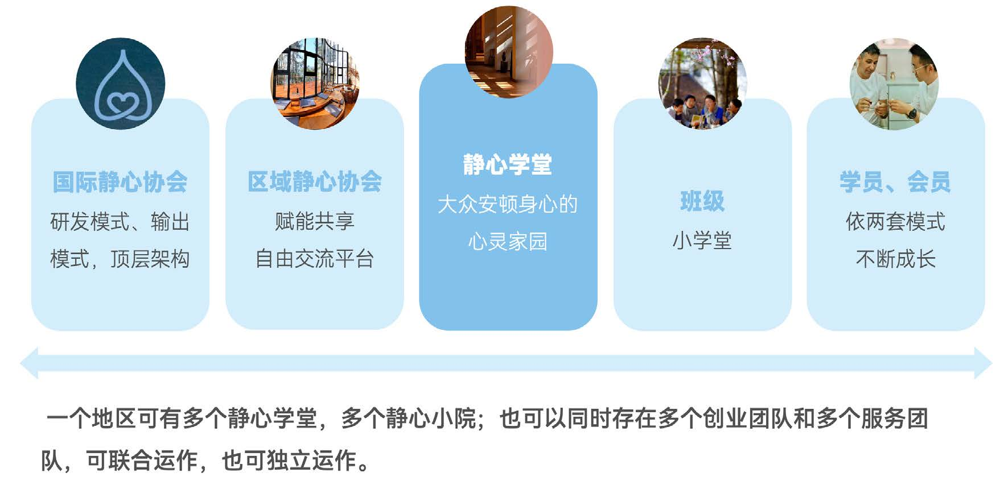
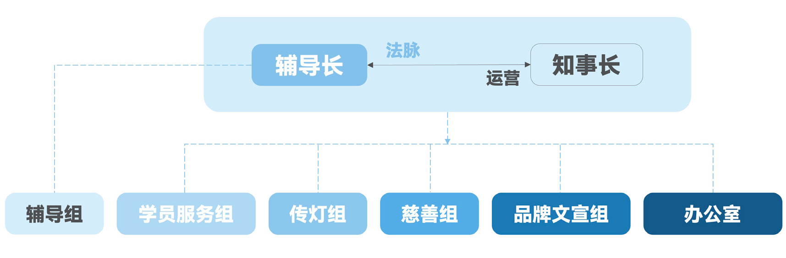
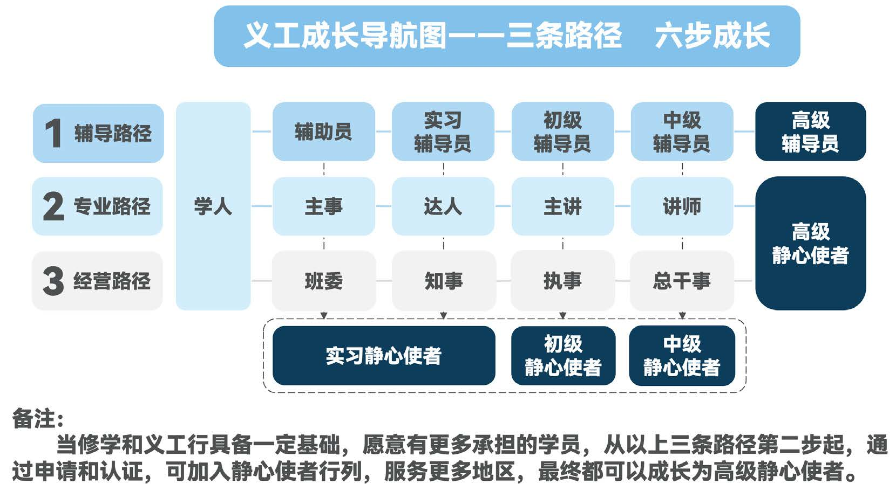

# 静心学堂手册

> 2025 年 1 月

## 一、引言

在物质繁荣而内心匮乏的时代，人类共同面临环境污染、国际冲突频繁，以及焦虑、抑郁等社会问题。世界唇齿相依，为安顿身心、和合共处，更需吸收东方智慧所蕴含的正念与慈悲，帮助现代人回归内在宁静与和谐。

静心学堂是国际静心协会创建的觉醒文化品牌，也是全球各地建设的实体禅意空间。作为国际静心协会全球静心文化生态的核心单元，静心学堂以纯公益的静心课程为核心产品，提供修学引导和服务大众两套模式。依托修学引导模式，开展正念禅修，增长智慧；依托服务大众模式，开展利他禅修，长养慈悲，帮助学员开启富有禅意的生活方式：怀悲心利他、以智慧处世、和乐生活、恭敬待人，开启践行自觉觉他、济世利人的觉醒人生。

本手册旨在：

- 帮助所有有志于参与静心学堂建设的学员对静心学堂有清晰了解；

- 提供静心学堂运营的详细说明和指导；

- 阐明学堂的部门职责、服务团队成员的岗位任务、可获取的服务与支持等信息，帮助相关人员更好地服务大众，在利益众生的平台上成长自己；

- 协助各静心学堂顺利成长，开设更多班级，分灯出更多静心学堂，为更多人创造觉醒的因缘。

## 二、认识静心学堂

### 1. 静心学堂是什么

传承两千多年生命觉醒教育，为现代人提供安顿身心之道。

**第一、传承一套佛法修学体系**

以菩提心、正见、正念、觉醒、利他为核心，传承系统的佛法修学课程体系。

**第二、共创一个觉醒文化品牌**

通过自觉、独立、优化、分灯，打造具有国际影响力的觉醒文化品牌。

**第三、共建一个清净和谐道场**

营造良好氛围，提供有效引导，共建静心禅意空间，使学堂成为大众的精神家园。

**第四、成就一个有法有爱团队**

依照自觉、法治、服务的精神，遵循六和敬（戒和同修、见和同解、利和同均、身和同住、口和无诤、意和同悦），打造如法、清净、和谐的修学团体。

### 2. 静心学堂的组织特征

**第一、班级为重心**

班级是学堂的基本单元，学员在班级中共同修学、互相支持。以学员为中心，以班级为重心，以辅导员为关键，做好班级经营。

**第二、班级互助群**

班级之间传帮带、互助共享，共同成长，形成学堂的整体力量。学堂通过统一规划和资源协调，支持班级的建设与发展。

**第三、学堂整体性**

在强调班级独立性的同时，学堂作为一个整体，统一运营，增强凝聚力和影响力。各班级在学堂的支持和服务下，推进辅导、修学、传灯、慈善等各项工作的开展。

### 3. 静心学堂的品牌内涵

**第一、文化的内涵**

我们传递的是东方文化的独特魅力：正念与慈悲大爱。

正念可以开启智慧，化解不良情绪，建立健全人格；慈悲大爱则因无我思想，进而能化解社会冲突，缔造人类和谐。

**第二、教育的内涵**

我们传递的是一种生命觉醒教育：塑造健全人格，完善生命品质。我们的课程教育具备核心要素、修学次第和实践方法，有氛围、有次第、有方法、有引导，适合大众化学习；我们提供的分阶教育，学习者沿着善士、学士、修士、胜士、智士的不同阶段，按阶学习，学以致用，终将获得相应的生命内涵与品质。

**第三、公益的内涵**

东方智慧文化具备普世价值，是人类文明的无价之宝，公益正是对无价最好的诠释。

如同阳光、空气和水，越是对难能可贵的事物，越是应该能便捷地获取。

这一东方智慧文化也不例外。我们基于互助与利他的理念，不断探索一条可持续发展的公益之路，使得任何喜欢这一文化的朋友，都能友好顺利地触达与获取。

**第四、禅意的内涵**

我们传递的是一种可感知的生活艺术与智慧气息。

我们将禅的智慧落实到生活中，成为一个空间、一件物品、一种生活方式，让人们把心带回当下，享受生命内在的宁静与祥和，清凉与喜悦。

**第五、觉醒的内涵**

觉醒是众生的希望所在，也是世界的希望所在。

生命的觉醒是人生最大的奢侈品，我们所有的努力，都是为了点亮内在的觉醒之灯，以此照破烦恼，祛除无明。同时，我们还要发愿帮助更多人点亮生命中的觉醒之灯。

### 4. 静心学堂修学体系

#### （1）修学体系的概述

静心学堂修学体系是由济群导师集四十余年学修所证和三十余年弘法经验而创建的。这套课程以大众化、系统化、可操作、可检验为主要特征，针对佛法修学中的主要问题，为现代人量身定制。

济群导师通过对佛法的深入研究与实践，将博大精深的佛法系统梳理和标准化，理清了修行的脉络和次第，提炼出修行的核心和重点。将修行的目标、次第、方法、流程、结果、检测等按照产品逻辑建立模式、形成标准，使学员看得懂、学得会。

这套完整的佛法修学体系，立足现实，导向究竟，将现实问题和终极问题相结合，为学员提供了完整的解决之道。

#### （2）体系在学堂的实践

在静心学堂，我们通过多种现代化的手段，将修学体系融入学堂的运营和课程中，使学员能够切实受益。

**第一、发挥佛法系统修学的优势**

通过系统的课程设置和修学方法，帮助学员全面、深入地理解佛法智慧，解决观念和心态问题，促进生命品质的提升。

**第二、契合大众根基，方便传播**

采用简明、通俗和标准化的方式，使深奥的佛法智慧变得易于理解和实践，方便传播，惠及更多大众。

**第三、提供完整的解决方案**

课程内容涵盖禅意生活、智慧人生、觉醒之道，帮助学员将佛法智慧应用于现实生活，实现身心和谐与健康成长。

#### （3）分阶教育的实施

为了满足不同学员的需求和修学程度，学堂依据佛教三乘设教理论（人天乘、解脱乘、菩萨乘），建立了差异化的分阶教育体系，为大众创造三根普被、利钝全收的修学因缘。

**第一阶段：学士课程**

- **学习内容**：围绕智慧人生和走近佛陀。

- **教育目标**：帮助学员成长为智慧、健康、幸福而又富有爱心的人。

- **特点和重要性**：是修学的基础阶段，引导学员初步接触佛法，培养正向生活态度和价值观。课程通俗易懂，降低修学门槛，适合所有对佛法和禅意生活感兴趣的人。

**第二阶段：修士课程**

- **学习内容**：围绕佛法要领及正念之道。

- **教育目标**：帮助学员成长为具有觉醒、解脱素养的人。

- **特点和重要性**：是修学的深化阶段，适合已有一定佛法基础，愿意深入理解佛法真谛的学员。通过系统学习和实践，培养正念，提升自我觉察，解决内在烦恼，迈向觉醒之路。

**第三阶段：胜士和智士课程**

- **学习内容**：围绕入菩萨行论、瑜伽菩萨戒、入不二法门和回归本心。

- **教育目标**：帮助学员成长为具有广大菩萨情怀和素养的人，学习做菩萨。

- **特点和重要性**：是修学的高级阶段，需要坚实的佛法基础和深厚的愿力。课程深入探讨菩萨道理念、空性智慧和实践方法，引导学员体悟空性真理，发广大心，践行无我利他，实现自觉觉他。

#### （4）分阶教育实施原则

为传承两千多年的生命觉醒教育，静心学堂遵循以下实施原则，旨在为现代人提供安顿身心之道。

**第一、广开修学之门，普及佛法**

- **推广同喜班，扩大基础学员群体**：将同喜班作为独立课程进行推广，开展禅意生活项目和读书会等多样化活动，吸引更多人参与，使学员在完成同喜班后，对佛法建立基本认识，为深入修学打下基础。

**第二、尊重学员选择，提供进阶支持**

- **让修学成为自主选择**：不强制学员进入更高阶段课程，减轻学习压力，使修学成为学员的自主决定。

- **提供引导与评估**：当学员有意愿深入学习时，进行评估和引导，确保其具备相应的修学基础和愿力，帮助他们进入更高阶段课程的学习。

**第三、从学员角度出发，提升修学效果**

- **明确修学理路，掌握修学要领**：帮助学员理解佛法修学的次第和要领，促进观念和心态的转化，提升生命品质。

- **强化课程落实与实践**：鼓励学员将佛法智慧应用于生活实践，实现身心和谐、全面成长。

- **建立评估与反馈机制**：定期评估学员的修学情况，提供及时反馈与指导，帮助他们克服困难，持续进步。

**第四、引导走向菩萨道，实现自觉觉他**

- **培养有愿力的学员**：发现并引导具备基础和愿力的学员进入更高阶段学习，践行无我利他。

- **助力弘法利生**：通过完整的修学体系，帮助学员开启正念与慈悲，走上生命觉醒之道，实现自觉觉他。

### 5. 静心学堂的生态角色

#### （1）静心学堂的对应关系

静心学堂作为全球静心文化生态体系的核心单元，承担着重要的角色。它是静心文化修学和传播的直接载体，通过自身的运营和发展，推动静心文化的广泛传播。

#### （2）在生态体系中的位置

**第一、核心单元**

静心学堂是学员进行修学实践的主要场所，承载着静心文化的核理念。

**第二、传播窗口**

通过各类活动和项目，静心学堂向社会大众广泛传播静心文化。

#### （3）与国际静心协会的关系

静心学堂是在国际静心协会授权下运营的静心文化载体，是致力于为广大民众提供安顿身心的心灵家园。

**第一、品牌授权**

通过国际静心协会的品牌授权，确保修学体系的统一性和规范性。

**第二、模式输出**

国际静心协会研发、输出静心文化模式，包括修学体系、运营模式等，为静心学堂的健康发展提供先进的理念、方法和工具。

**第三、战略支持**

国际静心协会为静心学堂提供战略指导与资源支持，帮助学堂更地开展修学和弘扬佛法的工作。

#### （4）与区域静心协会的关系

为促进学堂之间的合作与发展，区域内的静心学堂可以联合成立区域静心协会，作为公益平台，为学堂提供服务和支持。

**第一、交流平台**

促进区域内静心学堂的合作与经验交流，推动静心文化在当地的传播。

**第二、资源共享**

共享经验、资源和人才，提升学堂的运营水平。

**第三、赋能支持**

提供项目发布、培训和传帮带等支持，帮助学堂解决运营中的问题。

#### （5）全球静心文化生态系统

静心学堂、区域静心协会和国际静心协会共同构成了一个全球性的静心文化生态系统。静心学堂作为核心单元，通过自身的运营与发展，推动静心文化的广泛传播，助力实现共同的愿景：为世界带来智慧和清凉，引导人们从迷惑走向觉醒。

## 三、组织架构与职责

### 1. 组织架构图

静心学堂的组织架构由辅导长和知事长共同牵头，辅导长侧重法脉传承，知事长侧重运营统筹，两者共同推动静心学堂的建设与发展。

> 主要部门设置：由辅导组、学员服务组、传灯组、慈善组、品牌文宣组、办公室（含道场运营）组成。每个部门的负责人分别是：辅导长、学员服务知事、传灯知事、慈善知事、品牌文宣知事、道场运营知事（可由知事长兼任），他们与知事长共同组成学堂的服务团队。

静心学堂每月召开服务团队例会，分享经验，解决问题，协调推进学堂发展。学堂法律责任人（比如已注册主体的法人代表）或委托代表参加服务团队例会，保障学堂发展符合相关法律法规和安全等方面的要求。静心使者和班级辅导员可列席参加学堂服务团队例会，有助于静心使者对学堂提供及时而有效的支持，以及班级辅导员积极在所带班级落实决议事项。

### 2. 部门设置与职责

#### （1）辅导组

辅导组是学堂的核心部门，由辅导长牵头，并由各班级辅导员、辅导项目义工共同组成，侧重于法脉传承，推动和指导法脉传承在各路径和班级的落实。同时，辅导组为学堂营造清净如法的修学氛围，提供有效的陪伴，关爱和引导，使学员于法受益。可根据学堂因缘和不同阶段的发展需求，设立辅导对应的项目专员，负责相关项目在专业层面的模式传递、落地实施与人才传帮带成长。

**其工作重点：**

**第一、落实法脉传承**

- **以法为中心**：引导各部门和板块的工作以法为中心，让做事成为修行，确保其契合“静心学堂修学体系”的要求，不偏离佛陀本怀。

**第二、建设优秀的辅导团队**

- **提升辅导员素养**：以项目为载体，推动辅导员落实相关工作，提升八三、正念、利他三种禅修，不断提高能力和素养。

- **培养更多辅导员**：陪伴学员有效落实静心学堂课程及修学纲领，帮助学员具备八种能力素养，使更多学员走上辅导路径。

- **推动团队健康成长**：推动辅导员每月按时参加自新，撰写、分享辅导札记；关注辅导团队的需求，了解辅导员带班情况，及时发现并解决问题。

**第三、带班与班级经营**

- **规范带班流程**：帮助辅导员依照模式和流程规范带班，促进班级建立良好的修学氛围。

  - 如法组织 30 分钟平等交流。

  - 引导学员落实自修、组修、班修。

  - 落实三种禅修（八三、正念、利他）。

  - 加强班委建设和班级经营。

  - 引导学员建立真诚、认真、老实的修学态度，掌握修学方法，依次第修学，学会使用辅材、菩提导航、元日记等辅助工具。

**第四、知察事项**

- **关注修学状态**：留意班级和学员的修学情况，及时发现并解决问题，保障修学质量。

- **落实安全职责**：履行安全知察职能，为修学和义工行保驾护航。

**第五、团队互助，共创共建**

- **定期召开辅导组例会**：讨论辅导相关事项，制定工作计划，促进团队协作。

- **收集和分享优秀辅导经验**：收集各班级的优秀辅导经验，形成案例，分享推广，提升辅导团队的整体素养。

- **赋能与共建**：推动辅导员积极参加区域静心协会组织的俱乐部、论坛

等活动，获得支持与服务，共创共建。

#### （2）学员服务组

学员服务组由学员服务知事牵头，并由各班的组长、学服项目义工共同组成，主要负责修学的管理和服务，关注学员的修学体验与成长。也可根据学堂因和不同阶段的发展需求，设立对应的项目专员，负责相关项目在专业层面的模式传递、落地实施与人才传帮带成长。

**其工作重点：**

**第一、学籍服务**

- **学籍和考勤管理**：建立与维护学员档案，做好学籍与考勤相关的服务。

服务组长、支持班级做好考勤等修学过程的数据记录及分析。

- **修学关爱服务**：服务班级，推动班级做好修学关爱，帮助学员养成良好的修学习惯。关注各班级的修学状况，结合修学过程的数据分析，协调与整合各种关爱资源，为班级提供个性化的关爱与支持。

- **晋级结业服务**：宣导晋级的意义与殊胜性，推动班级组织学员的晋级和结业评定，确保修学阶段与课程的高质量有序推进。

**第二、身份认证**

- **身份认证宣导**：宣导四种身份（学士、修士、胜士、智士）认证的意义与殊胜性，推动学员积极参加四种身份认证。

- **身份认证组织**：组织四种身份认证，确保四种身份认证的高质量有效开展。

- **认证后的服务**：做好四种身份认证后的服务，为学员创造心行持续成长的增上缘。

**第三、团队互助，共创共建**

- **定期召开学员服务组例会**：讨论班级修学服务相关事项，及时发现并解决问题，促进团队协作。

- **收集和分享优秀服务经验**：收集各班级在修学服务方面的优秀经验，形成案例，分享推广，提升服务团队的整体素养，营造良好、有序的修学氛围。

- **赋能与共建**：积极参加区域静心协会组织的俱乐部、论坛等活动，获得支持与服务，共创共建。

#### （3）传灯组

传灯组由传灯知事牵头，并由各班级传灯班委、传灯项目义工共同组成，主要负责学堂的传灯活动和新班级的开设，推动静心文化的传播。根据学堂因缘和不同阶段的发展需求，传灯组可设立对应的项目专员，负责相关项目在专业层面的模式传递、落地实施与人才传帮带成长。

**其工作重点**：

**第一、开展传灯活动**

- **个人传灯**：鼓励学员在家庭和生活中实践传灯，激发大家的参与热情。

- **班级传灯**：推动各班级开展传灯项目，落实“一班一道场”，共同践行。

- **学堂传灯**：选择并深入推进 1-2 个重点特色项目，打造学堂的传灯品牌。

**第二、落地项目开展**

- **个人和班级项目**：帮助学员/ 班级选择适合的传灯项目，通过传帮带机制，促进个人和班级在项目中成长。

- **学堂项目**：协调和推动学堂层面的重点特色传灯项目，促进班级间的合作与共建。

- **获取专业支持**：通过区域静心协会自由交流平台，获得项目实施的专业指导和相关传帮带。

**第三、推动新班级开设**

- **推动开新班**：推动有条件的班级组建心灯分队，开设新班级；鼓励班级创业，开发新场地，创建静心小院。

- **赋能心灯分队**：围绕开班项目，为心灯分队提供传灯赋能，提供模式、资源与协助。

- **落实开班流程**：统筹和完善开班的各个环节，提升新班级的开班质量。

**第四、发展会员和培养人才**

- **发展会员**：通过禅意生活、智慧人生等项目，吸引和接引新会员，扩大会员群体，并进一步接引参加读书会、课程分享会，加入同喜班系统学习，开启智慧人生。

- **培养人才**：通过传帮带、培训和项目实践，发掘并培养有愿力的传灯人才，提升团队的经营能力与专业素养，促进传灯组的人才成长和队伍建设。

**第五、团队互助，共创共建**

- **定期召开传灯组例会**：讨论工作进展，及时发现并解决问题，促进团队协作。

- **收集和分享优秀传灯经验**：收集并整理各班级和各项目的优秀传灯经验，形成案例，分享推广，营造互助互学的良好氛围。

- **赋能与共建**：积极参加区域静心协会组织的俱乐部、论坛等活动，获得支持与服务，共创共建。

#### （4）慈善组

慈善组由慈善知事牵头，并由各班级慈善班委、慈善项目义工共同组成，主要负责组织学堂的慈善公益活动，践行佛教的慈悲精神。也可根据学堂因缘和不同阶段的发展需求，设立对应的项目专员，负责相关项目在专业层面的模式传递、落地实施与人才传帮带成长。其工作重点：

**第一、统筹慈善事项**

- 推动班级慈善，落实“关爱家人、关爱同修”。

- 优先重点在家庭、班级内落实慈善，营造良好的氛围。

**第二、对内慈善与团建**

- 支持班级开展关怀互助、团队建设等活动，增强班级凝聚力。

**第三、对外慈善活动**

- 根据当地因缘，开展对外慈善活动，提升静心学堂品牌形象，重点在于立足项目走进社团。

- 与传灯组共建，共同做好对外慈善活动，助力传灯。

**第四、人才培养**

- 通过传帮带、培训与项目实践，发掘并培养有愿力的慈善人才，提升团队的经营能力和专业素养，促进慈善组的人才成长和队伍建设。

**第五、团队互助，共创共建**

- 定期召开慈善组例会，讨论慈善相关事项，及时发现并解决问题，促进团队协作。

- 收集各班级在慈善活动中的优秀经验，形成案例，分享推广，提升慈善团队的整体素养，营造良好的慈善氛围。

- 积极参加区域静心协会组织的俱乐部、论坛等活动，获得支持与服务，共创共建。

#### （5）品牌文宣组

品牌文宣组由品牌文宣知事牵头，并由各班级文宣班委、文宣项目义工共同组成，主要负责学堂的品牌和文化宣传，提升学堂的社会形象和影响力。也可根据学堂因缘和不同阶段的发展需求，设立对应的项目专员，负责相关项目在专业层面的模式传递、落地实施与人才传帮带成长。

**其工作重点：**

**第一、品牌规范运营**

- 确保学堂各个项目围绕静心学堂的品牌定位、IP 形象、视觉规范展开运营。

- 面向学堂义工团队，传递品牌运营规范，协助团队树立品牌运营意识。

- 根据品牌形象的五个维度，对学堂运营项目及活动进行自检与评估，确保其符合静心文化内涵。

**第二、文化传播**

- 通过网站、社交媒体等多种渠道传播静心文化。

- 服务静心学堂品牌运营，推动班级关注国际静心协会官网、相关社交媒体，积极互动。

**第三、文宣材料制作**

- 编写、设计和制作活动海报、视频等文宣材料，支持各项活动的开展。

**第四、人才培养**

- 通过传帮带、培训与项目实践，发掘并培养有愿力的品牌文宣人才，提升团队的经营能力和专业素养，促进品牌文宣组的人才成长和队伍建设。

**第五、团队互助，共创共建**

- 定期召开品牌文宣组例会，讨论品牌文宣相关事项，及时发现并解决问题，促进团队协作。

- 收集各班级在品牌文宣方面的优秀经验，形成案例，分享推广，提升品牌文宣团队的整体素养，营造静心文化传播的良好氛围。

- 积极参加区域静心协会组织的俱乐部、论坛等活动，获得支持与服务，共创共建。

#### （6）办公室（含道场运营）

办公室由道场运营知事（可由知事长兼任）牵头，并由相关项目义工共同组成，主要负责学堂的日常行政管理和道场运营。也可根据学堂因缘和不同阶段的发展需求，设立对应的项目专员，负责相关项目在专业层面的模式传递、落地实施与人才传帮带成长。其工作重点：

**第一、道场运营（空间主理人）**

- 负责禅意空间的日常管理和修缮维护等事务。

- 注重学堂 “人- 货- 场” 的营造，包括日常及特定主题等项目和活动规划。

- 与服务团队共同制定道场运营目标和计划，依托班级，推动落实。

- 根据事项开展的轻重次第、义工人才情况，组建运营团队。

**第二、行政服务**

- 负责办理学堂主体身份的注册登记、年检等工作，确保学堂合法合规开展业务。

- 负责会议组织、文档管理、物资采购等日常行政工作。

**第三、财务法务**

- 负责学堂的财务收支管理、预算编制、定期财务报告，确保资金的合理使用。

- 负责学堂的法律事务，确保学堂运营的合法合规。

**第四、义工服务与人才培养**

- 义工档案管理

  - **建立义工档案**：记录义工的基本信息、服务时长，发放志愿者服务凭证。

  - **人才账本管理**：服务各班级、路径和项目，建立人才账本，做好义工记录，并根据需要反馈和使用。

- 义工成长与传帮带

  - **发现和培养人才**：发掘有潜力的义工，推动六步成长，提供认证服务，促进个人发展。

  - **规划义工资源**：根据学堂的发展规划与活动计划，统筹义工安排，合理调配资源，确保活动顺利进行。

  - **传帮带成长**：注重传帮带与人才梯队建设，提升团队整体素养和凝聚力。

**第五、团队互助，共创共建**

- 定期召开办公室例会，讨论相关事项，及时发现并解决问题，促进团队协作。

- 收集办公室在服务等方面的优秀经验，形成案例，分享推广，提升团队的整体素养，营造良好的服务氛围。

- 积极参加区域静心协会组织的俱乐部、论坛等活动，获得支持与服务，共创共建。

### 3. 关键角色

#### （1）辅导长

**第一、主要职责**

- 负责静心学堂的法脉传承和知察职能，指导法脉传承在各路径的落实。

- 统筹辅导组的各项工作，制定工作计划，带领团队完成部门职责。

- 积极参加区域静心协会辅导长例会，学习模式，传递精神，分享经验，解决问题。

- 积极参加静心学堂服务团队例会，促进团队和合，共同推动学堂健康成长。

- 积极参加区域静心协会举办的俱乐部、论坛等活动，提升自身素养，共创共建。

- 召集辅导团队例会，传递模式和精神，推动班级互助，解决带班问题，帮助辅导员成长。

**第二 、服务支持**

- 支持辅导员按模式规范带班，做好班级经营，促进辅导员能力素养的不断提升。

- 做好辅导团队建设，关爱每位辅导员的成长，确保每个班级的修学质量。

- 鼓励辅导员积极参与学堂运营，落实安全知察职能，共同提升学堂的修学氛围和服务水平。

#### （2）知事长

**第一、主要职责**

- 统筹静心学堂的运营工作，围绕“四个立足”制定目标和运营计划，并跟进实施。

- 具备法律和品牌意识，确保学堂运营合法合规，如理如法，符合静心学堂品牌授权规范。根据具体经营项目，组织服务团队及时对相关法律条文学习和交流，提升团队守法经营的意识。

- 召集服务团队例会，按照《例会共修 7 件事》组织会议，集体议事，及时发现并解决问题，促进团队和合。

- 协调区域协会、静心使者等资源，支持各路径项目和专项工作的落地实施。

- 负责分灯操作，推动服务团队的民主选举与换届工作，积极发现人才，建立第二梯队，确保学堂人才可持续发展。

- 积极参加区域静心协会举办的俱乐部、论坛等活动，提升自身素养，共创共建。

**第二、服务支持**

- 对班长进行传帮带，支持其成长与发展，提升班长的服务和运营能力，为学堂储备未来的经营人才。

- 与班长定期交流，讨论班级经营，分享优秀经验，解决实际问题，推动班级和个人的成长与发展，有效落实《班级手册》。

- 鼓励各班积极参与静心学堂的运营，共同提升学堂的修学氛围和服务水平。

- 推动各部门负责人落实人才培养职责，建立学堂人才账本，依“六步成长”提升团队整体素养。

#### （3）各部门知事

**第一、主要职责**

- 围绕学堂的整体目标和发展规划，统筹本部门的整体运营，制定相应计划，确保各项工作如理如法地开展，并跟进实施。

- 定期召集部门例会（包含本部门班委和项目义工），学习相关模式和最新精神，讨论各班级项目开展情况，解决实际问题，服务好各班班委。

- 积极参加静心学堂服务团队例会，参与集体议事，落实学堂的各项决议，及时发现并解决本部门相关问题，促进团队和合。

- 主动与其他部门协作，共同推进学堂的整体工作，提升学堂的修学氛围和服务水平。

- 积极参加区域静心协会举办的俱乐部、论坛等活动，提升自身素养，共创共建。

**第二、服务支持**

- 以项目为中心，选好重点项目，组建专项团队，做好传帮带、过程管理和跟踪服务。

- 支持服务各班班委，推动班级项目的顺利开展，促进班级和个人的成长与发展。

- 关注本部门业务在个人、班级和学堂层面的开展情况，组织经验交流，推广优秀案例，提升整体业务水平。

- 积极发现和培养人才，依“六步成长”，及时了解团队义工的服务情况，匹配合适人员，建立部门人才账本，做好传帮带，形成人人参与的良好氛围。

#### （4）班级辅导员

班级辅导员是静心学堂建设与发展的关键角色，肩负着引领班级、促进学堂发展的重要使命。作为班级经营的第一责任人，辅导员的职责和作用包括：

**第一、做好辅导项目，提升班级修学**

传帮带学员建立修学态度，掌握修学方法，提升修学质量；落实安全知察，营造清净、和谐的班级氛围，为班级健康发展保驾护航；关注学员的修学状态，及时给予引导与关爱，帮助学员在修学道路上稳步前行。

**第二、推动班级经营，助力学堂发展**

提升班级经营意识，将修学及服务大众能力传帮带给学员和班委；积极推动班级之间的互助合作，共同提升学堂的整体修学氛围；带领班级积极参与学堂的各项活动和运营，发挥班级在学堂建设中的作用。

**第三、培养人才，壮大学堂队伍**

引导并传帮带学员成长为辅导员，积极参与学堂的传灯、慈善、学员服务等义工行及学堂建设。储备和培养各类人才，确保学堂持续健康发展。

**第四、加强沟通，促进信息畅通**

作为学堂与学员之间沟通的重要管道，及时传递学堂的各项通知和决议，反馈学员的意见和建议，促进学堂与学员之间的双向沟通。积极参与学堂的会议和培训，保持与学堂的紧密联系。

**第五、以身作则，树立榜样**

不断提升自身的三大素养和服务能力，以慈悲心和责任感承担起辅导员的使命，以实际行动为学员树立榜样，影响和带动班级成员，为学堂建设贡献力量。

#### （5）静心使者

静心使者是静心学堂建设与发展的重要支持力量，他们根据自身的专长和学堂的需求，提供有针对性的服务，帮助学堂健康成长。其主要职责：

**第一、助力学堂发展：**根据学堂发展的实际需求，提供运营、项目实施等方面的支持，帮助学堂提升整体水平。

**第二、协助团队建设与人才培养：**协助学堂组建服务团队，提供培训、传帮带，帮助团队成员快速进入角色，提升运营能力。协助学堂发现和培养本地人才，建立人才梯队，确保学堂的持续健康发展。

**第三、加强沟通与合作：**列席参加学堂服务团队会议，与学堂建立有效的双向沟通机制，尊重本地团队，促进团队融合，形成良好的合作氛围，共同推进学堂发展。

**第四、提供资源支持与共享：**帮助学堂厘清发展思路，协助对接所需资源和专家，分享其他学堂的优秀案例与经验，促进学堂之间的互助合作。

**第五、推动新地区拓展：**与学堂一起规划新地区的拓展，提供拓展资源和支持，推动静心文化的广泛传播。

**第六、协助做好品牌运营：**协助学堂落实静心学堂的品牌精神和运营规范，确保运营如理如法，提升学堂的品牌影响力，服务社会。

**第七、以身作则，携手共进：**以身作则，践行静心文化，营造清净、和谐的氛围。与学堂携手共进，共同为静心文化的传承贡献力量。

此外，自主创业类的静心使者通过自主创业，在新的地区创建静心学堂。

他们以拓展精神为主线，从无到有地建立静心小院，进而申请静心学堂的品牌授权，依照品牌运营规范，实现东方智慧的标准化传承与传播。

## 四、学堂运营与发展

### 1. 做事与修行

#### （1）愿力和发心

勇于承担，自觉、主动、积极、热情地投入服务，这是让做事成为修行的基础。

#### （2）两大信念（修学为本、服务至上）

**第一、修学为本**：以修学为基础，认真践行静心学堂课程体系，提升个人智慧，实现内心的净化与觉醒，推动静心文化的广泛传播。

**第二、服务至上**：以服务大众为核心，认真践行利他实践，通过优质服务支持静心学堂及会员、学员的成长，增强自己的慈悲修行，营造清净和谐的文化氛围。

#### （3）运营的三种精神（自觉、法治、服务）

静心学堂的运营具有三种精神：

**第一、自觉的精神**：自觉践行修学及服务大众模式，走向觉醒。觉醒是每个众生的需要，通过有效落实模式，实现自觉、独立和自我优化，依托全球静心学堂，形成自觉独立、互联互通的全球静心文化生态网络。

**第二、法治的精神**：遵循佛法和学堂的规章制度，依法运作。以法为洲，立足《共处规则》，依两套模式开展修学和服务。特殊情况或模式以外的事项，通过《例会共修 7 件事》民主议事，80% 赞同为通过标准。

**第三、服务的精神**：以无我利他为宗旨，服务大众。践行菩萨道，利益他人。通过静心学堂的建设，创造更多清净因缘，帮助更多人于法受益，走向觉醒。克服自我的重要感、优越感和主宰欲，从以自我为中心转向以众生为中心，让做事成为修行。

#### （4）做事的四种精神（学习、检讨、服务、用心）

为避免陷入凡夫心，我们在义工行中应践行以下四种精神：

**第一、学习的精神**：学习是修行的基础。不断学习与践行修学和服务大众两套模式，提升专业技能，更新生命系统，突破自我局限，避免故步自封。

**第二、检讨的精神**：检讨是修行的起点。以佛法和模式为镜，发现个人和团队的不足，及时改进提升，真正走上修行之路。

**第三、服务的精神**：服务是利他的实践。从以自我为中心转向以众生为中心，践行无我利他。通过服务大众，传递正念和慈心，弱化我执，实现生命的超越和觉醒。

**第四、用心的精神**：用心是修行的关键。以正知正念，认真负责地做好每一件事，持续安住在利他、慈悲的心态中，避免陷入麻木和无记。

这四种精神，是我们在义工行中修行和成长的指引，帮助我们以正确的心态和方法，践行菩萨道，成就自他利益。

#### （5）人才团队三步法（了了分明、源源不断、生生不息）

培养人才和团队建设是知事长与各部门负责人最重要的职责。通过悉心发掘、关怀和引导团队中的每一位成员，逐步激发大家的潜能，营造清净、和谐、充满活力的团队氛围，让每个人在相互支持中共同成长。

**第一、了了分明**

做好人才账本，了解本团队义工情况。

**第二、源源不断**

- 通过《欢欢喜喜义工行》学习，提升学员加入义工行的愿望。

- 通过班委不断吸纳学员加入相关专业路径。

- 推动学员和班委积极参与到静心学堂的建设，扩大胸怀和视野。

**第三、生生不息**

- 提升管理能力和团队建设意识，依《团队建设 7 件事》打造理想团队。

- 带教者依《传帮带 5 件事》带领学习者六步成长，传帮带更多有潜力的本岗位人才，建立人才梯队，为学堂分灯做好储备。

#### （6）项目管理四步法（PDCA）

按 PDCA 项目管理理念，围绕学堂运营，运用缘起智慧，有条不紊做好每件事，让做事成为修行。

- Plan：目标和计划，围绕四个立足点制定目标和发展计划。

- Do：跟进与开展，定期团队例会，交流计划实施情况。

- Check：优化与调整，及时发现各项工作开展中存在的问题，及时调整，提出解决方案。

- Act：总结与提升，随喜优秀经验和检讨不足之处；检验心行成长，让做事成为修行。

### 2. 提升三大素养，实现六步成长

在静心学堂，我们倡导全体学员和义工通过践行修学模式与服务大众模式，全面提升修学素养、利他素养和专业素养，依托辅导、专业、经营三条成长路径，逐步实现从学人到高级辅导员、高级静心使者的六步成长，走向自觉觉他、自利利他的觉醒人生。这不仅是个人成长的路线图，也是静心学堂可持续发展的关键。

#### （1）三大素养

**第一、修学素养**：修行在日常，智慧为根本修学素养是个人修行与服务大众的根本，没有扎实的修学，其他素养和能力都无从谈起。修学素养立足于五处用心，落实三种禅修，培养正知正念，提升生命品质，烦恼减少，智慧增长，为身心安顿提供支持，最终找到生命的自觉与自由。只有在法上受益，才能生起纯粹的利他之心，推动自己不断前行。

**第二、利他素养**：慈心利他，以悲愿为动力利他素养是以菩提心的实践为核心。立足于《慈经》修行的基础，开展三级利他禅修，通过服务大众，培养利他心和慈悲心，实现自我超越。利他实践可以帮助我们弱化我执，打破自我中心，减少贪嗔痴等烦恼；可以帮助我们建立人与人之间的连接：培养理解、同情、接纳的心，改善人际关系；可以帮助我们实现菩提心的升华：从世俗菩提心迈向胜义菩提心，体认空性，生起平等慈悲。

**第三、专业素养**：扎根专业，服务大众专业素养是指在服务大众过程中所需的专业知识、技能与实践能力，是有效推动学堂各项工作的能力保障。专业素养的提升，使我们能够更高效地完成任务，推动项目发展，确保项目质量，实现自我价值，促进个人成长。

#### （2）六步成长

##### 1）六步成长概述

六步成长是学员和义工在静心学堂通过践行两套模式，依托三条成长路径，逐步实现个人修行和服务能力的提升，包括以下六个阶段：

① 学人\

② 辅助员/ 主事/ 班委/ 实习静心使者\

③ 实习辅导员/ 达人/ 知事/ 实习静心使者\

④ 初级辅导员/ 主讲/ 执事/ 初级静心使者\

⑤ 中级辅导员/ 讲师/ 总干事/ 中级静心使者\

⑥ 高级辅导员/ 高级静心使者\

##### 2）三条成长路径

根据个人兴趣和特长，六步成长分为辅导、专业、经营三条路径，每条路径都有清晰的成长阶梯。

第一、辅导路径

- 目标：培养高素养的辅导员，带领学员，落实两套模式。

- 成长阶段：学人- 辅助员- 实习辅导员- 初级辅导员- 中级辅导员-高级辅导员。

第二、专业路径

- 目标：培养各专业领域的达人和讲师，推动服务大众模式的发展。

- 成长阶段：学人- 主事- 达人- 主讲- 讲师- 高级静心使者。

第三、经营路径

- 目标：培养具备经营和统筹能力的服务人才，推动学堂的运营与发展。

- 成长阶段：学人- 班委- 知事- 执事- 总干事- 高级静心使者。

##### 3）实现六步成长的方法

第一、明确目标，制定计划

- 选择路径：根据自身兴趣、能力，选择合适的成长路径。

- 制定计划：根据每个阶段的要求，制定具体的成长目标和计划。

第二、提升三大素养

在每个成长阶段，同步提升修学、利他和专业素养：

- 修学素养：持续深入修学，完成解脱和慈悲相关心理建设。

- 利他素养：积极参与利他实践，提升利他心的层次。

- 专业素养：通过学习与实践，提升专业知识和技能。

第三、参与实践，承担责任

- 承担岗位：积极承担相应的岗位和职责，如辅助员、班委、主事等。

- 参与项目：参与学堂的各项活动和项目，在实践中成长。

第四、传帮带，团队协作

- 传帮带：主动培养新人，传承经验，实现团队的持续发展。

- 团队合作：加强沟通协作，共同解决问题，实现团队目标。

第五、接受评估，持续改进

- 接受考核：根据学堂的评定和认证机制，接受考核，确保能力与岗位匹配。

- 持续改进：根据反馈，不断提升自身综合素养。

#### （3）三大素养与六步成长的内在关系

第一、三大素养是六步成长的内在支撑，六步成长是落实和成就三大素养的实践路径，两者相辅相成，缺一不可。

- 修学素养：提供内在动力和智慧指引。没有修学素养，个人成长难以深入。

- 利他素养：是精神动力。培养利他心，才能持续投入服务大众的实践。

- 专业素养：是能力保障。具备专业能力，才能有效推动项目，承担更大责任。

第二、在六步成长的每个阶段，都需要同步提升三大素养，促进个人全面发展，实现自觉觉他、自利利他的人生目标。

提升三大素养，实现六步成长，是静心学堂全体学员和义工共同的努力方向。这不仅是个人成长的路径，也是学堂运营和发展的基石。通过明确的素养要求和成长路径，大家可以在服务大众的过程中，不断提升自我，实现人生价值。让我们共同努力，践行修学模式和服务大众模式，提升三大素养，实现六步成长，为传承智慧文化，利益广大众生贡献力量。

### 3. 发展思路与战略布局

#### （1）以“愿”为导，扩大传灯生态格局

第一、生态建设，扩大影响力：在个人和班级传灯的基础上，依托各类传灯项目大力开拓渠道合作资源，充分发挥静心品牌效应，通过广泛法宝结缘、各类社交媒体推广，合力开创静心文化的大生态传灯格局。

第二、广结善缘，做大蓄水池：立足禅意生活项目，广泛发展“静心之友”会员，扩大善士会员群体；立足智慧人生课程，接引大众进入读书会，进而进入同喜班系统修学（学士），收获智慧人生。通过落实分阶教育，做大同喜班，普及人生佛教，为更多人走上觉醒之道（修士、胜士、智士）创造善缘。

#### （2）以“场”为基，禅意生活安顿身心

第一、空间不可或缺：以禅意生活空间为载体，落地相应的禅意生活项目，营造良好的氛围与用户体验，打造富有精神内涵的禅意空间。

第二、多种空间形式：根据不同因缘，可以从家庭安心茶室、静心小院规模起步，也可以直接打造具备静心学堂道场规范的禅意空间。

#### （3）以“人”为本，全面创业点亮心灯

第一、海内外全面创业

- 自主创业：鼓励学员、班级、学堂积极发挥主人翁精神，大力推广家庭安心茶室，或组建心灯分队，创建更多静心小院，发展出更多静心学堂。

- 使者创业：鼓励静心使者志愿者积极出海创业，充分发掘地缘、项目、人才、网络等资源优势，全面撒网，多点开花，在海外建设出更多静心小院和静心学堂。

第二、心灯分队的组建

静心小院创业以及新开班建设应落实辅导前置精神，以拟带班辅导团队为中心，组建具备传灯点灯能力的心灯分队，依托传灯拓展模式、开班模式为指引，有序发展建设。心灯分队应学习相关模式及传帮带，由静心学堂/ 静心使者为心灯分队提供赋能及资源匹配。

### 4. 依托四个立足点，传承东方智慧，树立文化品牌

#### （1）立足项目，走进社团

**第一、选择重点项目**：以禅意生活为前导，以智慧人生为桥梁。各学堂因地制宜，选择重点项目发展，形成自己的爆款或特色。

**第二、开发拓展渠道**：依托所选项目，积极开拓社团、社区等渠道资源，扩大品牌认知度和影响力，建立广泛、稳定的合作伙伴关系，开源引流。

**第三、走出去，请进来**：本着“走出去，请进来”的原则，让静心学堂成为“蓄水池”和静心文化的传播基地。

#### （2）立足品牌，规范运营

**第一、专业运营**：学堂/ 班级发挥自觉独立的精神，在自主选择中健康成长。主动寻求专业化、资质化项目团队的支持与服务，推动项目有效落地和人才本地化，实现品牌化专业运营。

**第二、多元传播**：依托静心学堂课程体系，遵循静心学堂核心品牌规范，大力推动品牌文宣多渠道推广，实现静心学堂的全球化品牌传播。

#### （3）立足学员，走进家庭

**第一、倡导家庭禅意生活**：学员在实践禅意生活项目的同时，将禅意生活带入家庭，关爱家人和身边的朋友。

**第二、打造家庭安心茶室**：鼓励有条件的学员打造家庭安心茶室，举办有质量的家庭聚会，如静茶七式、按导养生、素食聚餐、智慧读书等，帮助亲友生起意乐向往。推荐亲友到静心学堂参与活动，接引走进智慧人生，踏上觉醒之道。

#### （4）立足班级，做好经营

**第一、以班级为重心**：有效开展班级传灯活动，是学堂传灯运营的基础保障。

**第二、以学堂为纽带**：学堂主动为各班的传灯、慈善赋能，组织交流，提供项目传帮带，激发、调动各班级的自觉能动性。

**第三、班级互助增上**：增强班级之间的互助、联动，共同打造学堂的爆款或特色经营项目，彰显静心学堂的品牌价值与内涵。

### 5. 静心学堂的建立、成长与分灯

静心学堂立足于品牌授权，实现全球连锁化运营。秉承“自觉、独立、优化、分灯”的精神，从静心小院起步，逐步发展成熟，成为合格的静心学堂，并通过分灯发展出更多学堂。

#### （1）静心小院与静心学堂的区别

**第一、静心小院**

- 目标：从茶禅空间起步，培育新地区的修学基础，逐步发展为静心学堂。

- 规模：面积不低于 30 平方米，0-3 个班。

- 授权：无需授权，向区域协会备案，获得支持。

**第二、静心学堂**

- 目标：功能完备的禅意空间，提供全方位的静心文化课程服务，成为大众的精神家园。

- 规模：面积不低于 100 平方米，3 个班以上，本地在学学员人数不低于 30 人。

- 授权：需向区域协会申请，获得国际静心协会的品牌授权。

#### （2）静心小院的建设与发展

**第一阶段：拓展初创期（0 个班）**

- 目标：组建召集人团队，打造禅意空间。

- 具体措施：

  - 组建 1-5 人的核心团队，向区域协会报备，立项静心小院创业。

  - 筹建静心小院的禅意空间，开源引流，积极开展传灯活动。

  - 鼓励注册身份：在小院运营阶段，可同步了解所在区域佛教或公益性组织身份注册的法律条款，为成立学堂做准备。（具体细则参见《静心学堂品牌授权手册》）。

**第二阶段：拓展成长期（1-2 个班）**

- 目标：开办种子班，建立传帮带关系。

- 具体措施：

  - 在已有班级的基础上，由辅导员所在的班级或静心学堂提供传帮带服务，或由创业型静心使者直接传帮带。

  - 第一个种子班开班后，向区域协会备案，获得进一步的服务支持。

第三阶段：独立运营期（3 个班及以上）

**- 目标：成立学堂服务团队，独立运营。**

- 具体措施：

  - 服务团队成员通过选举产生，负责日常运营。

  - 一旦条件成熟，根据《静心学堂品牌授权手册》，申请获得静心学堂品牌授权。

#### （3）静心学堂的品牌授权

##### 1）申请条件

**第一、基本因缘：**

- **合法身份**：必须是公益或慈善的非盈利组织，并符合当地的法律要求。

- **法人承担**：法人代表应是服务团队成员之一，如法人代表不是服务团队成员，法人代表本人( 或委托人) 对学堂经营具有知情权和议事权。

- **资质要求**：拥有符合静心学堂相关要求的资质，如文化传播、教育培训或宗教项目等资质。

- **名称规范**：申请者组织名称不含“静心”或“Mindful Peace”字样，以避免与品牌名称混淆。

**第二、业务资质：**

**班级数量**：至少拥有 3 个班级，本地在学学员人数达 30 人以上。

**团队成员**：拥有符合 7 位主要路径要求的运营团队成员，其中至少 4 人为本地学员。

**制度落实**：已落实团队例会制度，并熟悉《静心学堂手册》。

**项目开展**：至少有一个禅意生活项目落地，在六个月内成功开展 20 场以上的读书会。

**空间标准**：具备符合《静心学堂建设手册》标准的静心空间。

**第三、运营规划：**

**规划制定**：完成未来一至三年的静心学堂运营草案。

**第四、推荐：**

**团队认可**：基于团队对两套模式的理解与和合性，获得本片区静心使者的推荐。

##### 2）授权流程

**第一、自我规划**：服务团队学习《静⼼学堂⼿册》，完成⾃我检查，并制定 1-3 年运营规划。

**第二、提交申请**：填写申请表并提交⾄品牌服务中⼼。

**第三、参加恳谈会**：由区域静心协会品牌文宣部发起、邀请相关部门，和申请团队恳谈交流。

**第四、授权结果**：签署授权协议，如暂未达标，可获得进一步的改进建议与服务支持。

**第五、授权期限**：三年，其间每年最后一个月，服务团队需参加授权方组织的品牌运营年终自新会议，复盘并交流运营经验、需求和愿景。

##### 3）授权使用的基本规范和要求

**第一、合法合规**：静⼼学堂运营团队需严格遵守当地法律法规，并依照品牌运营⼿册共同建设。

**第二、使用范围**：授权仅适⽤于被授权团体组织的活动，禁⽌在其他⽤途上使⽤品牌。

**第三、授权区域**：默认授权区域为申请者所在国家或地区，特殊情况可另⾏申请。

**第四、违规处理与授权撤销**：如实际运营中有违反⼿册规定或品牌要求的情况，品牌授权方将提醒并提供改进建议。如拒绝改正或出现严重违规（如商业盈利、歪曲课程理念、违法违纪⾏为、政治意识倾向性等），品牌授权⽅保留⽴即收回品牌使⽤权的权利。

#### （4）静心学堂的发展与分灯

为了更好地传承智慧文化，深化修行实践，当学堂达到一定阶段时，将进行分灯。分灯不仅是学堂发展的重要举措，更是修行实践的体现。通过分灯，能够让更多的人参与到学堂的建设中来，促进自觉独立，使更多人受益。

根据学堂的发展情况，设定了两种分灯形式：成长型分灯和创业型分灯。

##### 1）成长型分灯

**第一、分灯意义**

成长型分灯是在学堂达到一定规模和成熟度后，为了避免团体我执，促进人才培养，提供更多承担机会，以及更精细化地服务学员和会员而进行的分灯。这种分灯有助于学堂的良性循环和持续发展，使更多人有机会在实践中提升修行，承担使命。

**第二、分灯条件**

**场地条件**：至少拥有 2 个禅意空间，分灯后各学堂至少保有一个禅意空间。

**班级条件**：当班级数量达到 10 个时可准备分灯，达到 20 个时必须分灯。

**学员人数**：本地在学学员 100 人以上。

**人才条件**：具备 7 位以上的知事级人才储备，知事长必须由本地学员担任。

**第三、实施步骤**

- **分灯决议**：服务团队评估分灯条件，形成分灯决议，并向全体班级宣导，达成共识。

- **分组原则**：遵循六项原则进行班级分组：

  - **自由性**：尊重各班级的自主选择。

  - **利他性**：本着利益他人的发心。

  - **缘起性**：考虑班级间形成的互助关系。

  - **就近性**：根据学员活动范围和共修场地的地理邻近性。

  - **互补性**：在班级经营和修学进度上相互补充。

  - **平衡性**：在人才和资源上应保持相对均衡；若分灯后两个团队平衡性不足，可建立传帮带关系。

- **民主评议**：依《静心学堂服务团队产生办法及细则》，分别产生新的服务团队。

- **平稳过渡**：原有服务团队做好分灯衔接和传帮带工作，确保顺利过渡。

##### 2）创业型分灯

**第一、分灯意义**

创业型分灯是面向那些尚未达到成长型分灯条件的学堂。当该学堂已经涌现出新的静心小院创业因缘，具备以下条件，可申请从原学堂分灯，独立运营发展，实现自我成长和承担。这不仅为学堂注入新的活力，也为更多人提供了学习和修行的机会。

**第二、分灯条件**

- 原学堂的班级数量至少在 5 个及以上，本地在学学员人数不低于 50 人

- 创业班级/ 学员组建召集人团队，发心在新的道场进行静心小院独立创业，该创业团队具备正常开展传灯、修学活动的能力，提出分灯申请。

- 创业分灯后，原学堂的服务团队能力不受影响，能够正常开展运营，分灯后的学堂班级数量不低于 3 个，本地在学学员不低于 30 人。

**第三、实施步骤**

- **分灯决议**：服务团队评估创业静心小院的申请，形成分灯决议，为其提供所需服务支持。

- **民主评议**：依静心小院的建设与发展规范，静心小院成立召集人团队。

- **平稳过渡**：学堂服务团队做好对新团队的相关传帮带工作，确保顺利过渡。

### 6. 区域静心协会的支持和服务

区域静心协会是静心学堂之间赋能共享、自由交流的平台，旨在促进各学堂的合作与共同成长。为了更好地利用区域协会的资源和支持，静心学堂需要明确自身在区域协会中的定位，积极参与并充分利用平台提供的机会和资源。

**第一、明确定位，积极参与区域协会**

- **理解角色和职责**：静心学堂是静心文化传播和实践的主体，在区域协会中既是资源的受益者，也是贡献者。学堂应明确自身在区域协会中的定位，主动承担相应的职责。

- **积极参与活动**：主动参加区域协会组织的各类活动，如培训、论坛、项目发布等，借助平台提升自身能力和影响力。

- **建立良好关系**：与区域协会保持密切联系，及时沟通需求和反馈，建立良好的合作关系。

**第二、利用自由交流平台，实现资源共享**

- **自由选择课程和项目**：区域协会提供课程发布、共享与交流的平台，学堂可以根据自身需求，自主选择并预约专项课程，实现“双向选择”。

- **参与项目学习与经验分享**：通过参加区域协会组织的俱乐部或论坛，学习专家和讲师分享的最新项目知识，借鉴经验丰富的项目达人的实践经验。

- **资源共享，互助共赢**：学堂应积极分享自身的优秀案例和实践经验，贡献于平台，促进资源的互通有无，实现共同成长。

**第三、需求驱动，定制化发展**

- **个性化学习与支持**：根据自身的发展阶段和实际需求，向区域协会提出具体的支持请求，获得定制化的课程、带教和资源支持。

- **促进团队成员成长**：利用区域协会提供的学习和交流机会，帮助学堂团队成员实现六步成长，提升整体素养和能力。

- **推动项目落地**：借助区域协会的支持，优化项目实施方案，确保重点项目在本学堂的有效落地与推广。

**第四、增强自主性，实现自觉独立发展**

- **建立自我管理模式**：在区域协会的指导下，学堂应逐步建立自我管理和持续改进的运营模式，增强自主性和自我发展能力。

- **发挥地区优势**：结合自身的特长和所在地区的特点，开展有特色的项目和活动，丰富静心文化的实践形式。

- **减少对中心化管理的依赖**：在遵守统一标准和规范的前提下，充分利用自主权，创新发展模式，提升学堂的成长力。

**第五、遵守规范，维护品牌形象**

- **统一品牌形象**：按照国际静心协会和区域协会的要求，规范使用品牌标识，维护静心学堂的整体形象。

- **合法合规运营**：在区域协会的协助下，完成合法身份注册，确保学堂运营的合法性和规范性。

- **积极反馈，持续改进**：及时向区域协会反馈运营中的问题和需求，积极参与协会的建设和完善，共同维护品牌声誉。

## 五、安全保障与风险防控

为了确保静心学堂的清净、纯粹和安全，创造一个健康、和谐的学习与交流环境，学堂在运营过程中需要高度重视安全保障与风险防控。

### 1. 安全与合规的重要性

安全与合规是静心学堂健康、平稳、长远发展的基础。只有在安全有保障的前提下，学堂才能更好地践行无我利他的宗旨，推进静心文化的传播与实践。学堂应高度重视安全与合规，在运营中自觉约束，智慧识别潜在风险，确保各项活动合法、合规、安全地进行。

### 2. 风险防控原则

为有效防范各类风险，保障学堂的安全运营，需遵循以下四项原则：

**第一、不谈论政治话题**

- **专注修学内容**：学堂应以分享静心生活体验、智慧人生心得为主要内容，专注于佛法修学和禅意生活的实践。

- **避免政治讨论**：严禁在学堂内讨论任何政治话题，包括但不限于国内外政治形势、政策评论等。保持环境的纯净与和谐，避免因政治话题引发争议或风险。

**第二、谨防邪教、外道及其他敏感团体**

- **提高警惕**：对可能涉及邪教、外道或其他敏感团体的信息保持高度警觉，避免与这些组织产生联系或受其影响。

- **坚守正法传承**：专注于正法的传承和修行，不参与任何违背佛教教义或法律法规的活动。

**第三、谨慎处理经济关系**

- **保持纯粹关系**：在学堂或协会的平台上，应避免建立任何形式的经济关系，如借贷、商业往来、理财投资等。

- **防范利益纠纷**：避免经济利益的介入，防止因经济纠纷导致的人际关系复杂化，以维护学堂清净、和谐的氛围。

**第四、海内外网络平台不互联**

- **信息发布规范**：关于海外活动的信息（如活动信息、图片、文字、学习材料等）不在国内社交平台上发布，例如微信群、朋友圈、视频号等。

- **使用适当平台**：建议使用海外社交平台（如 WhatsApp、Facebook、Instagram 等）发布相关信息，确保信息传播符合当地法律法规和平台规定。

- **保护信息安全**：通过区分海内外平台，防范信息安全风险，维护学堂和学员的合法权益。

### 3. 遵守法律法规

静心学堂在运营过程中，必须严格遵守所在地的法律法规和相关政策，确保各项活动的合法性与合规性。

**第一、遵守国家法律法规**

- **依法注册运营**：学堂应完成合法的注册手续，取得必要的资质和许可，依法开展各项活动。

- **尊重当地法律法规**：充分了解并遵守所在地的法律法规、宗教政策等，具备主人翁意识，自主经营，自行承担，避免触碰法律红线。

**第二、保护知识产权**

- **合法使用教材和资料**：尊重知识产权，确保使用的教材、音视频资料等均获得合法授权，不得侵权复制、传播。

- **规范传播内容**：在信息发布和传播中，遵守版权和平台规定，不发布侵权或违规内容。

**第三、维护数据隐私与安全**

- **保护学员信息**：严格保管学员的个人信息，未经本人同意，不得泄露或公开学员的姓名、联系方式等私人信息。

- **安全管理数据**：建立数据安全管理制度，防止信息泄露、篡改或丢失。

**第四、遵守公共秩序和良俗**

- **尊重文化差异**：在活动中尊重不同文化背景和信仰的人员，避免引发文化冲突。

- **维护社会和谐**：不从事任何扰乱公共秩序、损害社会稳定的活动，积极传播正能量。

> 本手册内容解释权归
>
> 国际静心协会(Mindful Peace International)
>
> 国际静心协会( 简称 MPI) 注册成立于瑞士苏黎世,
>
> 作为一个开放且非盈利的组织，
>
> 我们致力于静心文化的交流与传播。
>
> 更多详情请登陆官网： www.mindfulpeace.org
